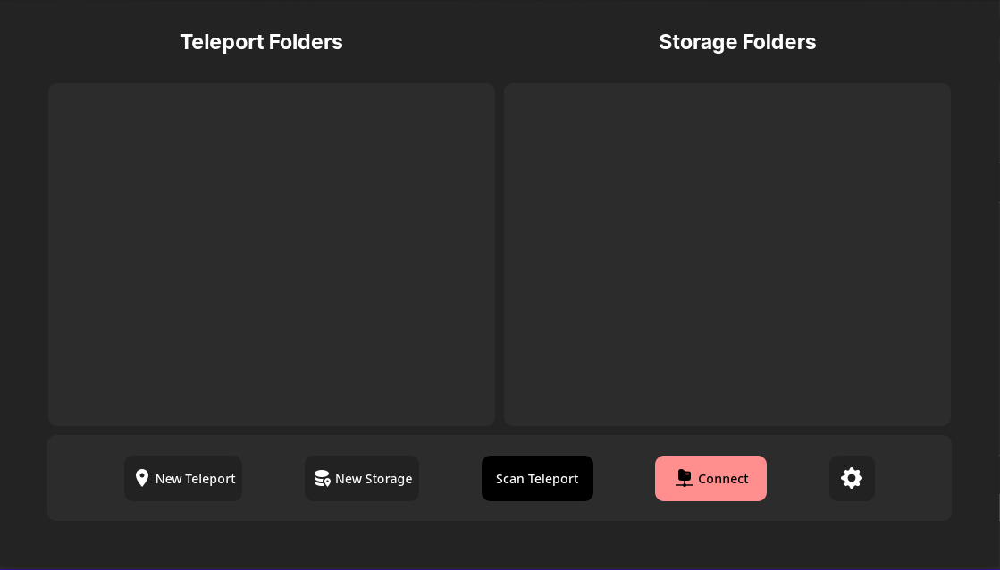

# Tereporto

 •
 •

- __Tereporto__ (テレポート) is a desktop-based application with the purpose of creating a shortcut when came to work with files and folders, take over the ability of _transferring files and folders_. Tereporto is written in Tauri, with a user interface that makes it easier to work with and a back-end service written in Rust that enhances the transfer and also ensures safety when executing.  

[Getting started](#getting-started) |
[Installation](#installation)

## Getting started

- The rule is pretty logic and simple, you first adding between `teleport` and `storage` directories, this way you will mark the directory you chosen with the `teleport marker` in the selected directory and same goes with storage.

- Then connect them together, that you will have a line of connection between two folders, so that you can move files and folders into `teleport folder` and that folder will immediately teleport to the `storage folder`.

- Make sure that you should only have one `storage folder` for each teleport, this is to prevent making the line being confusing where should it transfers to, it's pretty convenient to have different storages in different places or the same place if you want to.

- At present, you will able to have a numerous of line of connections unique with each others.

## Installation

